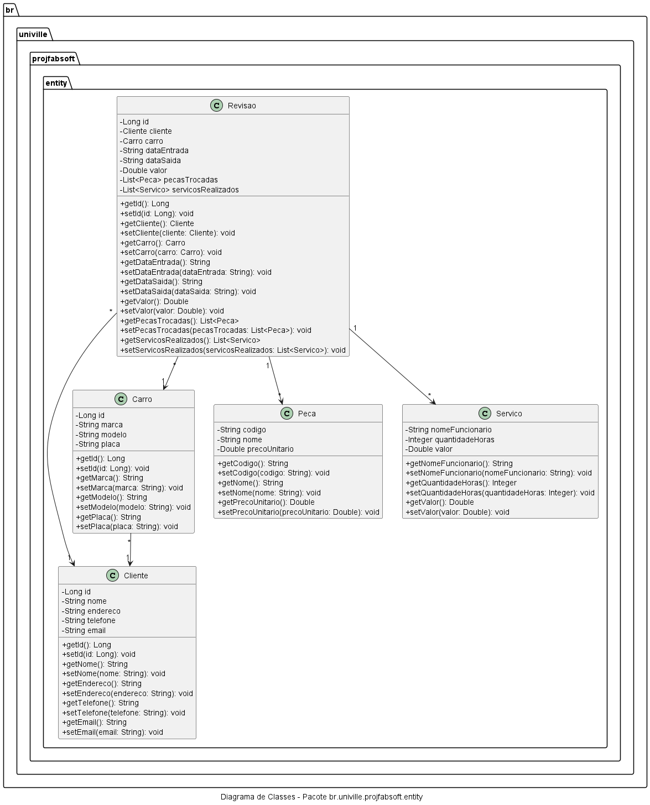
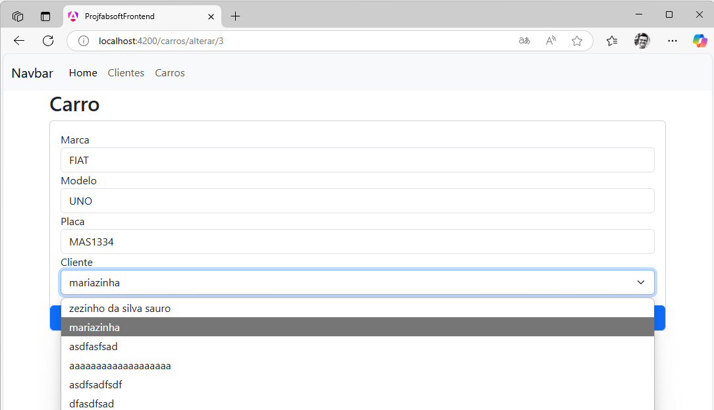

# Fábrica de Software 2025/1

## [📲🖥️Front-end](https://fabsoft2025frontend-aud3drfgchfaembt.brazilsouth-01.azurewebsites.net/) [🏬Back-end](https://fabsoft2025-adhtctehd6dwgdht.brazilsouth-01.azurewebsites.net/swagger-ui/index.html)

## Repositório dos alunos
- [Repos](https://gist.github.com/d4e37df9f6772173110603fc8bf90b84.git)

## Propostas de projeto

- Nome do sistema Ex:(Sistema para Mecânica)
  - Funcionalidade 1
  - Funcionalidade 2
  - Funcionalidade 3

<s>

- Nome do sistema Ex:(Sistema para Mecânica)
  - Funcionalidade 1
  - Funcionalidade 2
  - Funcionalidade 3

</s>


## Livro Eng Software Moderna
[Eng. Soft Moderna - Requisitos](https://engsoftmoderna.info/cap3.html)

## Histórias de Usuário
- Como um Atendente eu gostaria de registrar os dados do cliente como: nome, endereço, telefone, email
- Como um Atendente eu gostaria de registrar os dados do Carro do cliente como: marca, modelo, placa
- Como um Atendente eu gostaria de vincular o Carro ao Cliente
- Como um Atedente eu gostaria de agendar uma revisão com os seguintes dados: cliente, carro, data entrada, data saida, valor da revisão
- Como um Atendente eu gostaria de vincular peças trocadas na revisão com os seguintes dados: codigo, nome, preço unitário
- Como um Atendente eu gostaria de vincular os serviços de mão de obra realizados na revisão com os seguintes dados: nome do funcionário, quantidade de horas, valor


## Comandos do Git

### Instalação
[Git Bash](https://git-scm.com/downloads)

### Configuração inicial

```
git config --global user.name "NOME DO USUARIO NO GITHUB"
git config --global user.email "EMAIL DA CONTA DO GITHUB"
```
### Tipos de mensagens do commit

- feat: (new feature for the user, not a new feature for build script)
- fix: (bug fix for the user, not a fix to a build script)
- docs: (changes to the documentation)
- style: (formatting, missing semi colons, etc; no production code change)
- refactor: (refactoring production code, eg. renaming a variable)
- test: (adding missing tests, refactoring tests; no production code change)
- chore: (updating grunt tasks etc; no production code change)

### Commit e Push

```
git add .
git commit -m "tipo: o que foi feito"
git push -u origin main
```

### Ambiente de desenvolvimento JAVA
[Eclipse Adoptium](https://adoptium.net/)
[Microsoft OpenJDK](https://www.microsoft.com/openjdk)
[AWS CORRETTO](https://aws.amazon.com/pt/corretto/)
[VSCode](https://code.visualstudio.com/download)
[Extension Pack for Java](https://marketplace.visualstudio.com/items?itemName=vscjava.vscode-java-pack)


- JRE - Java Runtime Environment
   - Java Virtual Machine JVM 
     - java.exe / javaw.exe
- JDK - Java Development Kit
  - Compilar o java (javac.exe)

## Diagrama de classes


## Prompts Aula 01/04/2025
- Encontrar as entidades nas histórias de usuário
```bash
@workspace #sym:## Histórias de Usuário quais são as entidades
```
- Gerar as classes java das entidades
```bash
@workspace por favor, crie as classe em java no pacote entity para representar as entidades
```
- Gerar o Diagrama de Classes de Entidade (Domínio)
```bash
@workspace por favor gere um diagrama uml no padrão plantuml das classes do pacote br.univille.projfabsoft
```
- Instalar a extensão [PlantUML](https://marketplace.visualstudio.com/items?itemName=jebbs.plantuml)

## Diagrama de classes Entidade (Domínio)


## Clean Architecture

[Livro Arquitetura Limpa](https://integrada.minhabiblioteca.com.br/reader/books/9788550808161/pageid/0)


## Frontend Angular

- Criar o projeto Angular
```bash
ng new projfabsoft-frontend
```

- Acessar a pasta do projeto

```bash
cd projfabsoft-frontend
```

- Executar o servidor do Angular

```bash
ng serve
```
- Para acessar o frontend utilize o link [http://localhost:4200](http://localhost:4200)

- Instalação do Bootstrap

```bash
npm install bootstrap
```

- No arquivo angular.json [🔗](./projfabsoft-frontend/angular.json)

```json
"styles": [
    "src/styles.css",
    "node_modules/bootstrap/dist/css/bootstrap.css"
],
"scripts": [
    "node_modules/bootstrap/dist/js/bootstrap.js"
]
```

### Gerando a primeira tela de Cliente 

- Gerando o componente do Angular

```bash
ng generate component cliente
```

- Criando a interface gráfica HTML /src/app/cliente/cliente.component.html [🔗](./projfabsoft-frontend/src/app/cliente/cliente.component.html)

```html
<main class="container">
    <table class="table">
        ....
    </table>
</main>
```

- Criando a classe Model

```bash
ng generate class model/cliente
```

- Código da classe /src/app/model/cliente.ts [🔗](./projfabsoft-frontend/src/app/model/cliente.ts)

```ts
export class Cliente {
    id: number;
    nome: string;
    endereco: string;
    telefone: string;
    email: string;
    dataNascimento: Date;
}
```

- Configurar o arquivo tsconfig.json [🔗](./projfabsoft-frontend/tsconfig.json) para suportar a não inicialização dos atributos 

```bash
"compilerOptions": {
    "strictPropertyInitialization": false,
} 
```

- Gerar o serviço

```bash
ng generate service service/cliente
```

- Codigo do serviço /src/app/service/cliente.service.ts [🔗](./projfabsoft-frontend/src/app/service/cliente.service.ts)

```ts
import { Injectable } from '@angular/core';
import { Cliente } from '../model/cliente';
import { HttpClient } from '@angular/common/http';


@Injectable({
  providedIn: 'root'
})
export class ClienteService {
  apiURL = "http://localhost:8080/api/v1/clientes";
  
  constructor(private http:HttpClient) { }

  getClientes(){
    return this.http.get<Cliente[]>(this.apiURL);
  }

}
```

- Alterar o arquivo /src/app/app.component.html [🔗](./projfabsoft-frontend/src/app/app.component.html) para gerar apenas a tela dos componentes

```html
<router-outlet />
```

- Modificar o código do componente /src/app/cliente/cliente.component.ts [🔗](./projfabsoft-frontend/src/app/cliente/cliente.component.ts) para chamar o serviço e guardar a lista de clientes em um atributo

```ts
import { Component } from '@angular/core';
import { Cliente } from '../model/cliente';
import { ClienteService } from '../service/cliente.service';
import { HttpClientModule } from '@angular/common/http';
import { CommonModule } from '@angular/common';

@Component({
  selector: 'app-cliente',
  imports: [HttpClientModule,CommonModule],
  templateUrl: './cliente.component.html',
  styleUrl: './cliente.component.css',
  providers: [ClienteService]
})
export class ClienteComponent {
  listaClientes: Cliente[] = [];

  constructor(private clienteService: ClienteService) {}

  ngOnInit() {
    console.log("Carregando clientes...");
    this.clienteService.getClientes().subscribe(clientes => {
      this.listaClientes = clientes;
    });
  }
}
```

- Modificar o arquivo /src/app/cliente/cliente.component.html [🔗](./projfabsoft-frontend/src/app/cliente/cliente.component.html) para desenhar a tabela de clientes

```html
<main class="container">
    <h2>Clientes</h2>
    <table class="table">
        <thead>
            <tr>
                <th>Nome</th>
            </tr>
        </thead>
        <tbody>
            <tr *ngFor="let umCliente of listaClientes">
                <td>{{umCliente.nome}}</td>
            </tr>
        </tbody>
    </table>
</main>
```

- Modificar o arquivo /src/app/app.routes.ts [🔗](./projfabsoft-frontend/src/app/app.routes.ts) para incluir a rota para o componente

```ts
import { Routes } from '@angular/router';
import { ClienteComponent } from './cliente/cliente.component';
export const routes: Routes = [
    { path: 'clientes', component: ClienteComponent }
];
```

- Rodar a aplicação

```bash
ng serve
```

- [Cross-origin resource sharing](https://pt.wikipedia.org/wiki/Cross-origin_resource_sharing)

- No projeto Backend Java Spring Boot crie um pacote chamado br.univille.projfabsoft.config, e dentro dele uma classe WebConfig.java [🔗](./projfabsoft/src/main/java/br/univille/projfabsoft/config/WebConfig.java) com o seguinte código:


```java
package br.univille.projfabsoft.config;


import org.springframework.context.annotation.Configuration;
import org.springframework.web.servlet.config.annotation.CorsRegistry;
import org.springframework.web.servlet.config.annotation.EnableWebMvc;
import org.springframework.web.servlet.config.annotation.WebMvcConfigurer;

@Configuration
@EnableWebMvc
public class WebConfig implements WebMvcConfigurer  {

    @Override
    public void addCorsMappings(CorsRegistry registry) {
        registry.addMapping("/**")
                .allowedHeaders("*")
                .allowedOriginPatterns("*")
                .allowedOrigins("*")
                .allowedMethods("*")
                .maxAge(1800);

    }
}
```

## Criação da tela de cadastro de clientes

- Alterar o arquivo /src/app/cliente/cliente.component.ts para importar o Router e criar a função novo()

```ts
import { Router } from '@angular/router';

@Component({
  selector: 'app-cliente',
  imports: [HttpClientModule, CommonModule],
  templateUrl: './cliente.component.html',
  styleUrl: './cliente.component.css',
  providers: [ClienteService, Router]
})

constructor(
    private clienteService:ClienteService,
    private router:Router
){}
novo(){
  this.router.navigate(['clientes/novo']);
}    
```
- Alterar o arquivo /src/app/cliente/cliente.component.html criar o botao para a nova tela de formulário

```html
<a (click)="novo()" class="btn btn-primary">Novo</a>
```

- Alterar o arquivo /app/app.routes.ts para registrar a rota da nova tela

```ts
import { Routes } from '@angular/router';
import { ClienteComponent } from './cliente/cliente.component';
import { FormClienteComponent } from './form-cliente/form-cliente.component';

export const routes: Routes = [
    { path: 'clientes', component: ClienteComponent},
    { path: 'clientes/novo', component: FormClienteComponent},
];
```

- Abrir o console e digitar o comando para criar um novo componente que será a tela de cadastro

```bash
ng generate component form-cliente
```

- Alterar o arquivo /app/service/cliente.service.ts para incluir o método de salvar o cliente e chamar o endpoint POST da API

```ts
import { Injectable } from '@angular/core';
import { Cliente } from '../model/cliente';
import { HttpClient } from '@angular/common/http';


@Injectable({
  providedIn: 'root'
})
export class ClienteService {
  apiURL = "http://localhost:8080/api/v1/clientes";
  
  constructor(private http:HttpClient) { }

  getClientes(){
    return this.http.get<Cliente[]>(this.apiURL);
  }

  saveCliente(cliente:Cliente){
    return this.http.post(this.apiURL,cliente);
  }

}
``` 

- Alterar o codigo do arquivo /app/form-cliente/form-cliente.component.ts para importar os componentes e chamar o método salvar do serviço

```ts
import { Component } from '@angular/core';
import { Cliente } from '../model/cliente';
import { ClienteService } from '../service/cliente.service';
import { HttpClientModule } from '@angular/common/http';
import { CommonModule } from '@angular/common';
import { FormsModule } from '@angular/forms';
import { Router } from '@angular/router';

@Component({
  selector: 'app-form-cliente',
  imports: [HttpClientModule, CommonModule, FormsModule],
  templateUrl: './form-cliente.component.html',
  styleUrl: './form-cliente.component.css',
  providers: [ClienteService, Router]
})
export class FormClienteComponent {
    cliente: Cliente = new Cliente();

    constructor(
      private clienteService:ClienteService,
      private router:Router
    ){}

    salvar(){
      this.clienteService.saveCliente(this.cliente)
        .subscribe(resultado => {
            this.router.navigate(['clientes']);
        });
    }
}
```

- Alterar o codigo do arquivo /app/form-cliente/form-cliente.component.html para desenhar a tela

```ts
<main class="container">
    <h2>Cliente</h2>
    <div class="card">
        <div class="card-body">
            <div class="form-group">
                <label for="txtNome">Nome</label>    
                <input type="text" 
                    [(ngModel)]="cliente.nome"
                    class="form-control"
                    id="txtNome">
            </div>
        </div>
        <button (click)="salvar()" 
        class="btn btn-primary">Salvar</button>
    </div>
</main>
```

## Funcionalidade de ALTERAR

- Modifique o controlador [ClienteController](./projfabsoft/src/main/java/br/univille/projfabsoft/controller/ClienteController.java) no projeto Java Spring Boot para incluir um novo endpoint para buscar um único cliente pelo ID

```java
@RestController
@RequestMapping("/api/v1/clientes")
public class ClienteController {

    @GetMapping("/{id}")	
    public ResponseEntity<Cliente> getClienteId(@PathVariable Long id){
        var cliente = service.getById(id);

        return new ResponseEntity<Cliente>(cliente, HttpStatus.OK);
    }
```

- Retorne ao projeto ANGULAR e altere o service do [cliente.service.ts](./projfabsoft-frontend/src/app/service/cliente.service.ts) para criar o método para buscar o cliente pelo ID

```ts
  getClienteById(id: any) {
    return this.http.get<Cliente>(this.apiURL + '/' + id);
  }
```

- Altere a tela do Cliente [cliente.component.html](./projfabsoft-frontend/src/app/cliente/cliente.component.html) para incluir o botao ALTERAR na tela

```html
      <table class="table">
        <thead>
            <tr>
                <th>Nome</th>
                <th>Endereço</th>
                <th>Telefone</th>
                <th>E-mail</th>
                <th>Data Nascimento</th>
                <th></th> <!-- ALTERADO-->
            </tr>
        </thead>
        <tbody>
            <tr *ngFor="let umCliente of listaClientes">
                <td>{{umCliente.nome}}</td>
                <td>{{umCliente.endereco}}</td>
                <td>{{umCliente.telefone}}</td>
                <td>{{umCliente.email}}</td>
                <td>{{umCliente.dataNascimento | date:'dd/MM/yyyy'}}</td>
                <td><a (click)="alterar(umCliente)" 
                    class="btn btn-secondary">Alterar</a></td> <!-- ALTERADO-->
            </tr>
        </tbody>
    </table>
```

- Altere o controlador da tela [cliente.component.ts](./projfabsoft-frontend/src/app/cliente/cliente.component.ts) para incluir a função alterar()

```ts
  alterar(cliente:Cliente){
      this.router.navigate(['clientes/alterar', cliente.id]);
  }
```

- Altere o arquivo de rotas da aplicação [app.routes.ts](./projfabsoft-frontend/src/app/app.routes.ts) para incluir a nova rota de alterar

```ts
import { Routes } from '@angular/router';
import { ClienteComponent } from './cliente/cliente.component';
import { FormClienteComponent } from './form-cliente/form-cliente.component';

export const routes: Routes = [
    {path: 'clientes', component: ClienteComponent},
    {path: 'clientes/novo', component: FormClienteComponent},
    {path: 'clientes/alterar/:id', component: FormClienteComponent} //ALTERADO
];
```

- Altere o controlador do formulário do cliente [form-cliente.component.ts](./projfabsoft-frontend/src/app/form-cliente/form-cliente.component.ts) para receber o id do cliente, chamar o serviço do cliente e mostrar em tela os dados do cliente retornado pelo backend

```ts
import { Component } from '@angular/core';
import { Cliente } from '../model/cliente';
import { ClienteService } from '../service/cliente.service';
import { HttpClientModule } from '@angular/common/http';
import { CommonModule } from '@angular/common';
import { FormsModule } from '@angular/forms';
import { Router, ActivatedRoute, ParamMap } from '@angular/router'; //ALTERADO

@Component({
  selector: 'app-form-cliente',
  imports: [HttpClientModule, CommonModule, FormsModule],
  templateUrl: './form-cliente.component.html',
  styleUrl: './form-cliente.component.css',
  providers: [ClienteService, Router]
})
export class FormClienteComponent {
    cliente:Cliente = new Cliente();

    constructor(
      private clienteService: ClienteService,
      private router: Router,
      private activeRouter: ActivatedRoute //ALTERADO
    ) {
        //ALTERADO
        const id = this.activeRouter.snapshot.paramMap.get('id');
        
        if (id) {
          this.clienteService.getClienteById(id).subscribe(cliente => {
            this.cliente = cliente;
        });
        //ALTERADO
      }
    }

    salvar(){
      this.clienteService.saveCliente(this.cliente)
          .subscribe( res => {
            this.router.navigate(['clientes']);
          });
    }

}
```

- Modifique o service do cliente [cliente.service.ts](./projfabsoft-frontend/src/app/service/cliente.service.ts) para na função saveCliente() verificar se a propriedade id estiver preenchida, chamar o método PUT da API.

```ts
  saveCliente(cliente:Cliente){
    if(cliente.id){
      return this.http.put(this.apiURL + '/' + cliente.id, cliente);
    }
    return this.http.post(this.apiURL,cliente);
  }
```

## Funcionalidade de EXCLUIR

-  Abrir o terminal e digitar o comando abaixo para instalar a definição de tipos do bootstrap no typescript

```bash
npm i @types/bootstrap
```

- Alterar o arquivo [cliente.service.ts](./projfabsoft-frontend/src/app/service/cliente.service.ts) para incluir a função de excluir cliente e chamar o método delete da API no backend

```ts
excluirCliente(id: any){
  return this.http.delete<Cliente>(this.apiURL + '/' + id);
}
```

- Alterar o arquivo [cliente.component.html](./projfabsoft-frontend/src/app/cliente/cliente.component.html) para incluir o código HTML necessário para que o bootstrap crie uma janela de confirmação (MODAL)

```html
<div class="modal fade" #myModal tabindex="-1" role="dialog">
    <div class="modal-dialog" role="document">
        <div class="modal-content">
            <div class="modal-header">
                <h5 class="modal-title">Excluir cliente</h5>
            </div>
            <div class="modal-body">
            Confirma a exclusão do cliente?
            </div>
            <div class="modal-footer">
            <button type="button" class="btn btn-secondary" (click)="fecharConfirmacao()">Cancelar</button>
            <button type="button" class="btn btn-primary" (click)="confirmarExclusao()">Sim</button>
            </div>
        </div>
    </div>
</div>
```

- Alterar o arquivo [cliente.component.html](./projfabsoft-frontend/src/app/cliente/cliente.component.html) para incluir o código HTML necessário para que o botao excluir seja apresentado em cada cliente

```html
<td><a (click)="alterar(umCliente)" 
    class="btn btn-secondary">Alterar</a>
    <!--botao excluir -->
    <a (click)="abrirConfirmacao(umCliente)" 
    class="btn btn-danger">Excluir</a>
    <!--botao excluir -->
</td>
```


- Alterar o arquivo [cliente.component.ts](./projfabsoft-frontend/src/app/cliente/cliente.component.ts) para importar os seguintes objetos

```ts
// MANTER OS IMPORTS JA EXISTENTES
import { Component, ElementRef, ViewChild } from '@angular/core';
import * as bootstrap from 'bootstrap';
```

- Ainda no arquivo [cliente.component.ts](./projfabsoft-frontend/src/app/cliente/cliente.component.ts) criar duas variáveis para encontrar a referencia da janela de confirmação modal do bootstrap

```ts
@ViewChild('myModal') modalElement!: ElementRef;
private modal!: bootstrap.Modal;

private clienteSelecionado!: Cliente;
```

- Ainda no arquivo [cliente.component.ts](./projfabsoft-frontend/src/app/cliente/cliente.component.ts) criar o código das funções para abrir e fechar a janela de confirmação

```ts
abrirConfirmacao(cliente:Cliente) {
    this.clienteSelecionado = cliente;
    this.modal = new bootstrap.Modal(this.modalElement.nativeElement);
    this.modal.show();
}

fecharConfirmacao() {
  this.modal.hide();
}
```

- Ainda no arquivo [cliente.component.ts](./projfabsoft-frontend/src/app/cliente/cliente.component.ts) criar o código da função confirmar exclusão que deverá chamar o service para excluir o registro e em caso de sucesso, fechar a janela e buscar novamente todos os clientes no backend para atualizar a tabela.

```ts
confirmarExclusao() {
    this.clienteService.excluirCliente(this.clienteSelecionado.id).subscribe(
        () => {
            this.fecharConfirmacao();
            this.clienteService.getClientes().subscribe(
              clientes => {
                this.listaClientes = clientes;
              }
            );
        },
        error => {
            console.error('Erro ao excluir cliente:', error);
        }
    );
}
```

## Funcionalidade de MUITOS PARA UM

- Na tela de cadastro de Carros é possível selecionar o Cliente que é o dono



- A entidade [Carro](./projfabsoft-frontend/src/app/model/carro.ts) precisa ter um atributo do tipo Cliente

```ts

import { Cliente } from "./cliente";

export class Carro {
    id: number;
    marca: string;
    modelo: string;
    placa: string;
    cliente: Cliente
}
```

- No controlador do formulário do carro [form-carro.component.ts](./projfabsoft-frontend/src/app/form-carro/form-carro.component.ts) importar o model Cliente e seu serviço

```ts
//MANTER OS OUTROS IMPORTS
import { Cliente } from '../model/cliente';
import { ClienteService } from '../service/cliente.service';
```

- No controlador do formulário do carro [form-carro.component.ts](./projfabsoft-frontend/src/app/form-carro/form-carro.component.ts) incluir o ClienteService nos providers

```ts
@Component({
  selector: 'app-form-carro',
  imports: [HttpClientModule, CommonModule, FormsModule],
  templateUrl: './form-carro.component.html',
  styleUrl: './form-carro.component.css',
  providers: [CarroService, Router, ClienteService] //ALTERAR AQUI
})
```

- No controlador do formulário do carro [form-carro.component.ts](./projfabsoft-frontend/src/app/form-carro/form-carro.component.ts) criar uma variavel lista para guardar os clientes

```ts
export class FormCarroComponent {
    carro:Carro = new Carro();
    
    public listaClientes:Cliente[] = []; //INCLUIR AQUI

```

- No controlador do formulário do carro [form-carro.component.ts](./projfabsoft-frontend/src/app/form-carro/form-carro.component.ts), no construtor carregar a lista de usuários chamando os serviço do cliente

```ts
    constructor(
      private carroService: CarroService,
      private clienteService: ClienteService, //INCLUIR AQUI
      private router: Router,
      private activeRouter: ActivatedRoute
    ) {
        const id = this.activeRouter.snapshot.paramMap.get('id');
        //INCLUIR AQUI
        this.clienteService.getClientes().subscribe(clientes =>{
            this.listaClientes = clientes;
        });
        //INCLUIR AQUI

        if (id) {
          this.carroService.getCarroById(id).subscribe(carro => {
            this.carro = carro;
          });
        }
    }

```

- No controlador do formulário do carro [form-carro.component.ts](./projfabsoft-frontend/src/app/form-carro/form-carro.component.ts), criar um novo método compararClientes para ensinar o Angular a comparar dois objetos Cliente. Necessário para que o select funcione.

```ts
  comparaClientes(obj1: Cliente, obj2: Cliente): boolean {
    return obj1 && obj2 ? obj1.id === obj2.id : obj1 === obj2;
  }
```

- Na tela de formulário do Carro [form-carro.component.html](./projfabsoft-frontend/src/app/form-carro/form-carro.component.html) incluir o campo select para listar os clientes em tela.

```html
<div class="form-group">
    <label for="txtCliente">Cliente</label>
    <select id="txtCliente" [(ngModel)]="carro.cliente" class="form-select" [compareWith]="comparaClientes">
        <option *ngFor="let umCliente of listaClientes" [ngValue]="umCliente">{{ umCliente.nome }}</option>
    </select>
</div>
```

## Funcionalidade de UM PARA MUITOS - Cadastro Pai/Filho

- No projeto Angular, criar as classes Model para cada uma das entidades do Java envolvidas na tela.

```ts
export class Peca {
    id: number;
    codigo: string;
    nome: string;
    precoUnitario: number;
}
```


```ts
export class Servico {
    id: number;
    nomeFuncionario: string;
    quantidadeHoras: number;
    valor: number;
}
```

```ts
import { Cliente } from "./cliente";
import { Peca } from "./peca";
import { Servico } from "./servico";

export class Revisao {
    id: number;
    cliente: Cliente;
    dataEntrada: Date;
    dataSaida: Date;
    valor: number;
    pecasTrocadas: Peca[];
    servicosRealizados: Servico[];
}
```

 - Criar a classe de serviço apenas para a entidade principal da tela, neste caso a Revisão. Por que? Porquê as instâncias das classes Peça e Serviço serão salvas junto com a Revisão.

```bash
ng generate service service/revisao
```

```ts
import { Injectable } from '@angular/core';
import { Revisao } from '../model/revisao';
import { Peca } from '../model/peca';
import { Servico } from '../model/servico';
import { HttpClient } from '@angular/common/http';

@Injectable({
  providedIn: 'root'
})
export class RevisaoService {

  apiURL = "http://localhost:8080/api/v1/revisoes";

  constructor(private http:HttpClient) { }

  getRevisoes(){
     return this.http.get<Revisao[]>(this.apiURL);
  }
  getRevisaoById(id: any) {
    return this.http.get<Revisao>(this.apiURL + '/' + id);
  }
  saveRevisao(revisao:Revisao){
    if(revisao.id){
      return this.http.put(this.apiURL + '/' + revisao.id, revisao);
    }
    return this.http.post(this.apiURL,revisao);
  }

  excluirRevisao(id: any){
    return this.http.delete<Revisao>(this.apiURL + '/' + id);
  }
}
```

- Construir o componente da tela principal da revisão.

```bash
ng generate component revisao
```

- Registar o componente no arquivo [app.routes.ts](./projfabsoft-frontend/src/app/app.routes.ts)

```ts
import { Routes } from '@angular/router';
import { ClienteComponent } from './cliente/cliente.component';
import { FormClienteComponent } from './form-cliente/form-cliente.component';
import { CarroComponent } from './carro/carro.component';
import { FormCarroComponent } from './form-carro/form-carro.component';
import { RevisaoComponent } from './revisao/revisao.component';

export const routes: Routes = [
    {path: 'clientes', component: ClienteComponent},
    {path: 'clientes/novo', component: FormClienteComponent},
    {path: 'clientes/alterar/:id', component: FormClienteComponent},

    {path: 'carros', component: CarroComponent},
    {path: 'carros/novo', component: FormCarroComponent},
    {path: 'carros/alterar/:id', component: FormCarroComponent},

    {path: 'revisoes', component: RevisaoComponent} //ALTERAR AQUI

];
```

- Criar o código html do componente [revisao.component.ts](./projfabsoft-frontend/src/app/revisao/revisao.component.html)

```html
<main class="container">
    <h2>Revisões</h2>
    <a (click)="novo()" class="btn btn-primary">Novo</a>
    <table class="table">
        <thead>
            <tr>
                <th>Data Entrada</th>
                <th>Data Saída</th>
                <th>Cliente</th>
                <th>Valor</th>
                <th></th>
            </tr>
        </thead>
        <tbody>
            <tr *ngFor="let umaRevisao of listaRevisoes">
                <td>{{umaRevisao.dataEntrada | date:'dd/MM/yyyy'}}</td>
                <td>{{umaRevisao.dataSaida | date:'dd/MM/yyyy'}}</td>
                <td>{{umaRevisao.cliente !== null ? umaRevisao.cliente.nome : ''}}</td>
                <td>{{umaRevisao.valor}}</td>
                <td><a (click)="alterar(umaRevisao)" 
                    class="btn btn-secondary">Alterar</a>
                    &nbsp;
                    <a (click)="abrirConfirmacao(umaRevisao)" 
                        class="btn btn-danger">Excluir</a>
                
                </td>
            </tr>
        </tbody>

    </table>
</main>

<div class="modal fade" #myModal tabindex="-1" role="dialog">
    <div class="modal-dialog" role="document">
        <div class="modal-content">
            <div class="modal-header">
                <h5 class="modal-title">Excluir Revisão</h5>
            </div>
            <div class="modal-body">
            Confirma a exclusão da Revisão?
            </div>
            <div class="modal-footer">
            <button type="button" class="btn btn-secondary" (click)="fecharConfirmacao()">Cancelar</button>
            <button type="button" class="btn btn-primary" (click)="confirmarExclusao()">Sim</button>
            </div>
        </div>
    </div>
</div>
```

- Criar o código do controlador [revisao.component.ts](./projfabsoft-frontend/src/app/revisao/revisao.component.ts) similar ao cadastro simples

```ts
import { Component,ElementRef, ViewChild } from '@angular/core';
import { Revisao } from '../model/revisao';
import { RevisaoService } from '../service/revisao.service';
import { HttpClientModule } from '@angular/common/http';
import { CommonModule } from '@angular/common';
import { Router } from '@angular/router';
import * as bootstrap from 'bootstrap';

@Component({
  selector: 'app-revisao',
  imports: [HttpClientModule, CommonModule],
  templateUrl: './revisao.component.html',
  styleUrl: './revisao.component.css',
  providers: [RevisaoService, Router]
})
export class RevisaoComponent {
    public listaRevisoes:Revisao[] = [];

    @ViewChild('myModal') modalElement!: ElementRef;
    private modal!: bootstrap.Modal;

    private revisaoSelecionada!: Revisao;
        
    constructor(
      private revisaoService:RevisaoService,
      private router:Router
    ){}

    ngOnInit(): void {
      this.revisaoService.getRevisoes().subscribe(resposta => {
          this.listaRevisoes = resposta;
      })
    }
    novo(){
      this.router.navigate(['revisoes/novo']);
    }
    alterar(revisao:Revisao){
      this.router.navigate(['revisoes/alterar', revisao.id]);
    }

    abrirConfirmacao(revisao:Revisao) {
        this.revisaoSelecionada = revisao;
        this.modal = new bootstrap.Modal(this.modalElement.nativeElement);
        this.modal.show();
    }

    fecharConfirmacao() {
      this.modal.hide();
    }


    confirmarExclusao() {
        this.revisaoService.excluirRevisao(this.revisaoSelecionada.id).subscribe(
            () => {
                this.fecharConfirmacao();
                this.revisaoService.getRevisoes().subscribe(
                  revisoes => {
                    this.listaRevisoes = revisoes;
                  }
                );
            },
            error => {
                console.error('Erro ao excluir revisão:', error);
            }
        );
    }
}
```

- Crie o componente para o formulário da tela de revisão

```bash
ng generate component form-revisao
```

- Registre as rotas no arquivo [app.routes.ts](./projfabsoft-frontend/src/app/app.routes.ts)

```ts
import { Routes } from '@angular/router';
import { ClienteComponent } from './cliente/cliente.component';
import { FormClienteComponent } from './form-cliente/form-cliente.component';
import { CarroComponent } from './carro/carro.component';
import { FormCarroComponent } from './form-carro/form-carro.component';
import { RevisaoComponent } from './revisao/revisao.component';
import { FormRevisaoComponent } from './form-revisao/form-revisao.component';

export const routes: Routes = [
    {path: 'clientes', component: ClienteComponent},
    {path: 'clientes/novo', component: FormClienteComponent},
    {path: 'clientes/alterar/:id', component: FormClienteComponent},

    {path: 'carros', component: CarroComponent},
    {path: 'carros/novo', component: FormCarroComponent},
    {path: 'carros/alterar/:id', component: FormCarroComponent},

    {path: 'revisoes', component: RevisaoComponent},
    {path: 'revisoes/novo', component: FormRevisaoComponent}, //ALTERACAO AQUI
    {path: 'revisoes/alterar/:id', component: FormRevisaoComponent} //ALTERACAO AQUI

];
```

- Implemete o formulário da Revisão [form-revisao.component.html](./projfabsoft-frontend/src/app/form-revisao/form-revisao.component.html) apenas com os atributos de tipos primitivos, as associações vamos fazer em seguida:


```html<main class="container">
    <h2>Revisão</h2>
    <div class="card">
        <div class="card-body">
            <div class="form-group">
                <label for="txtDataEntrada">Data Entrada</label>
                <input type="date" [(ngModel)]="revisao.dataEntrada" 
                class="form-control" id="txtDataEntrada">
            </div>

            <div class="form-group">
                <label for="txtDataSaida">Data Saída</label>
                <input type="date" [(ngModel)]="revisao.dataSaida" 
                class="form-control" id="txtDataSaida">
            </div>

            <div class="form-group">
                <label for="txtValor">Valor</label>
                <input type="number" [(ngModel)]="revisao.valor" 
                class="form-control" id="txtValor">
            </div>

            
        </div>

        <button (click)="salvar()"
            class="btn btn-primary">Salvar</button>

    </div>
</main>
```

-  Implemente o controlador do formulário [form-revisao.component.ts](./projfabsoft-frontend/src/app/form-revisao/form-revisao.component.ts) de Revisão idêntico ao controlador do cadastro simples.

```ts
import { Component } from '@angular/core';
import { Revisao } from '../model/revisao';
import { RevisaoService } from '../service/revisao.service';
import { HttpClientModule } from '@angular/common/http';
import { CommonModule } from '@angular/common';
import { FormsModule } from '@angular/forms';
import { Router, ActivatedRoute, ParamMap } from '@angular/router';

@Component({
  selector: 'app-form-revisao',
  imports: [HttpClientModule, CommonModule, FormsModule],
  templateUrl: './form-revisao.component.html',
  styleUrl: './form-revisao.component.css',
  providers: [RevisaoService, Router]
})

export class FormRevisaoComponent {
    revisao:Revisao = new Revisao();

    constructor(
      private revisaoService: RevisaoService,
      private router: Router,
      private activeRouter: ActivatedRoute
    ) {
        const id = this.activeRouter.snapshot.paramMap.get('id');
        
        if (id) {
          this.revisaoService.getRevisaoById(id).subscribe(revisao => {
            this.revisao = revisao;
        });
      }
    }

    salvar(){
      this.revisaoService.saveRevisao(this.revisao)
          .subscribe( res => {
            this.router.navigate(['revisoes']);
          });
    }
}
```

- IMPORTANTE: faça o teste da sua aplicação neste ponto e garanta que o seu cadastro esta funcionando

### Inclusão do campo de seleção dos Clientes

- Alterar o controlador do formulário da Revisão [form-revisao.component.ts](./projfabsoft-frontend/src/app/form-revisao/form-revisao.component.ts) para chamar o serviço do Cliente para buscar a lista de clientes que irá preencher o campo de seleção de clientes no formulário

```ts
import { Component,ElementRef, ViewChild } from '@angular/core';
import { Revisao } from '../model/revisao';
import { RevisaoService } from '../service/revisao.service';
import { HttpClientModule } from '@angular/common/http';
import { CommonModule } from '@angular/common';
import { FormsModule } from '@angular/forms';
import { Router, ActivatedRoute, ParamMap } from '@angular/router';

import { Cliente } from '../model/cliente'; //ALTERAR AQUI
import { ClienteService } from '../service/cliente.service'; //ALTERAR AQUI

@Component({
  selector: 'app-form-revisao',
  imports: [HttpClientModule, CommonModule, FormsModule],
  templateUrl: './form-revisao.component.html',
  styleUrl: './form-revisao.component.css',
  providers: [RevisaoService, Router, ClienteService] //ALTERAR AQUI
})

export class FormRevisaoComponent {
    revisao:Revisao = new Revisao();

    public listaClientes:Cliente[] = []; //ALTERAR AQUI

    constructor(
      private revisaoService: RevisaoService,
      private router: Router,
      private clienteService: ClienteService, //ALTERAR AQUI
      private activeRouter: ActivatedRoute
    ) {
        const id = this.activeRouter.snapshot.paramMap.get('id');
        
        //ALTERAR AQUI
        this.clienteService.getClientes().subscribe(clientes =>{
            this.listaClientes = clientes;
        });
        //ALTERAR AQUI

        if (id) {
          this.revisaoService.getRevisaoById(id).subscribe(revisao => {
            this.revisao = revisao;
        });
      }
    }

    salvar(){
      this.revisaoService.saveRevisao(this.revisao)
          .subscribe( res => {
            this.router.navigate(['revisoes']);
          });
    }

    //ALTERAR AQUI
    comparaClientes(obj1: Cliente, obj2: Cliente): boolean {
      return obj1 && obj2 ? obj1.id === obj2.id : obj1 === obj2;
    }
    //ALTERAR AQUI
}
```

- Alterar o codigo HTML do componente Form da revisão [form-revisao.component.html](./projfabsoft-frontend/src/app/form-revisao/form-revisao.component.html) para incluir o campo de seleção de clientes no formulário

```html
<main class="container">
    <h2>Revisão</h2>
    <div class="card">
        <div class="card-body">
            
            <!-- ALTERAR AQUI -->
            <div class="form-group">
                <label for="txtCliente">Cliente</label>
                <select id="txtCliente" [(ngModel)]="revisao.cliente" class="form-select" [compareWith]="comparaClientes">
                    <option *ngFor="let umCliente of listaClientes" [ngValue]="umCliente">{{ umCliente.nome }}</option>
                </select>
            </div>
            <!-- ALTERAR AQUI -->

            <div class="form-group">
                <label for="txtDataEntrada">Data Entrada</label>
                <input type="date" [(ngModel)]="revisao.dataEntrada" 
                class="form-control" id="txtDataEntrada">
            </div>

            <div class="form-group">
                <label for="txtDataSaida">Data Saída</label>
                <input type="date" [(ngModel)]="revisao.dataSaida" 
                class="form-control" id="txtDataSaida">
            </div>

            <div class="form-group">
                <label for="txtValor">Valor</label>
                <input type="number" [(ngModel)]="revisao.valor" 
                class="form-control" id="txtValor">
            </div>

            
        </div>

        <button (click)="salvar()"
            class="btn btn-primary">Salvar</button>

    </div>
</main>
```

### Inclusão das entidades Filho no cadastro Pai-Filhos - Model Peças

- Alterar o HTML formulário da Revisão [form-revisao.component.ts](./projfabsoft-frontend/src/app/form-revisao/form-revisao.component.html) para incluir uma tabela do HTML para listar todas as peças de uma revisão

```html
    
    <div class="form-group">
        <label for="txtValor">Valor</label>
        <input type="number" [(ngModel)]="revisao.valor" 
        class="form-control" id="txtValor">
    </div>
    <!-- INICIO DA ALTERACAO -->
    <br>
    <div class="card">
        <div class="card-body">
            <h5 class="card-title">Peças</h5>
            <a (click)="incluirPeca()" 
                class="btn btn-secondary">Incluir Peça</a>
            <table class="table">
                <thead>
                    <tr>
                        <th>Código</th>
                        <th>Nome</th>
                        <th>Preço Unitário</th>
                        <th></th>
                    </tr>
                </thead>
                <tbody>
                    <tr *ngFor="let umaPeca of revisao.pecasTrocadas">
                        <td>{{umaPeca.codigo}}</td>
                        <td>{{umaPeca.nome}}</td>
                        <td>{{umaPeca.precoUnitario}}</td>
                        <td>
                            <a (click)="excluirPeca(umaPeca)" 
                                class="btn btn-danger">Excluir</a>
                        </td>
                    </tr>
                </tbody>
            </table>
        </div>
    </div>
    <!-- FIM DA ALTERACAO -->
</div>

<button (click)="salvar()"
    class="btn btn-primary">Salvar</button>
```

- Alterar o HTML formulário da Revisão [form-revisao.component.ts](./projfabsoft-frontend/src/app/form-revisao/form-revisao.component.html) para incluir uma janela modal, que será o formulário de inclusão da peça. IMPORTANTE: incluir este código no final do arquivo

```html
<div class="modal fade" #myModalPeca tabindex="-1" role="dialog">
    <div class="modal-dialog" role="document">
        <div class="modal-content">
            <div class="modal-header">
                <h5 class="modal-title">Nova Peça</h5>
            </div>
            <div class="form-group">
                <label for="txtPecaCodigo">Código</label>
                <input type="text" [(ngModel)]="peca.codigo" 
                    class="form-control" id="txtPecaCodigo">
            </div>
            <div class="form-group">
                <label for="txtPecaNome">Nome</label>
                <input type="text" [(ngModel)]="peca.nome" 
                    class="form-control" id="txtPecaNome">
            </div>
            <div class="form-group">
                <label for="txtPecaPrecoUnitario">Preço Unitário</label>
                <input type="number" [(ngModel)]="peca.precoUnitario" 
                    class="form-control" id="txtPecaPrecoUnitario">
            </div>
            <div class="modal-footer">
                <button type="button" class="btn btn-secondary" (click)="fecharConfirmacaoPeca()">Cancelar</button>
                <button type="button" class="btn btn-primary" (click)="salvaPeca()">Salvar</button>
            </div>
        </div>
    </div>
</div>
```
- Alterar o arquivo controller do component form Revisao [form-revisao.component.ts](./projfabsoft-frontend/src/app/form-revisao/form-revisao.component.ts) para incluir os imports e uma variável que guardará os dados da nova peça digitada

```ts
import { Cliente } from '../model/cliente';
import { ClienteService } from '../service/cliente.service';

import { Peca } from '../model/peca'; //ALTERAR AQUI!!!
import * as bootstrap from 'bootstrap'; //ALTERAR AQUI!!!

@Component({
  selector: 'app-form-revisao',
``` 

```ts
revisao:Revisao = new Revisao();

peca:Peca = new Peca(); //ALTERAR AQUI!!!
@ViewChild('myModalPeca') modalElementPeca!: ElementRef; //ALTERAR AQUI!!!
private modalPeca!: bootstrap.Modal; //ALTERAR AQUI!!!

public listaClientes:Cliente[] = [];
```

- Alterar o arquivo controller do component form Revisao [form-revisao.component.ts](./projfabsoft-frontend/src/app/form-revisao/form-revisao.component.ts) para criar o codigo da função incluirPeca que deverá abrir o modal de cadastro, salvarPeca que deverá incluir a nova peça na lista de itens e excluirPeca que deverá remover a peça da lista.

```ts
incluirPeca():void{
  this.peca = new Peca();
  this.modalPeca = new bootstrap.Modal(this.modalElementPeca.nativeElement);
  this.modalPeca.show();
}
salvaPeca():void{
  if(this.revisao.pecasTrocadas == null){
      this.revisao.pecasTrocadas = [];
  }
  this.revisao.pecasTrocadas.push(this.peca);
  this.modalPeca.hide();
}
fecharConfirmacaoPeca():void{
  this.modalPeca.hide();
}

excluirPeca(peca: Peca): void{
  this.revisao.pecasTrocadas = 
    this.revisao.pecasTrocadas.filter((p) => p.id !== peca.id);
}
```

## Publicação da Aplicação

### Java / Spring Boot

- Alterar o arquivo [pom.xml](./projfabsoft/pom.xml) para incluir a dependência da biblioteca do SQL Server

```xml
<dependency>
  <groupId>com.microsoft.sqlserver</groupId>
  <artifactId>mssql-jdbc</artifactId>
  <scope>runtime</scope>
</dependency>
```

- Criar um novo arquivo na pasta [/src/main/resources/application-prod.properties](./projfabsoft/src/main/resources/application-prod.properties) com as configuracões para conectar no banco do Microsft SQL Server lindo ❤️

```json
spring.application.name=projfabsoft

spring.jpa.database-platform=org.hibernate.dialect.SQLServerDialect
spring.datasource.driver-class-name=com.microsoft.sqlserver.jdbc.SQLServerDriver
spring.datasource.url=${DB_CONNECTION_STRING}
spring.datasource.username=${DB_USERNAME}
spring.datasource.password=${DB_PASSWORD}
spring.jpa.hibernate.ddl-auto=update
```

### Angular

- Criar na raiz do projeto [projfabsoft_frontend/Dockerfile](./projfabsoft_frontend/Dockerfile) para fazer o build da aplicação front-end no formato de um container Docker

- IMPORTANTE: substituir dentro do arquivo projfabsoft_frontend pelo nome da pasta do seu projeto,
caso seja diferente

```docker
# Stage 1: Build
FROM node:18 AS build

# Set working directory
WORKDIR /app

# Copy package.json and package-lock.json
COPY package.json package-lock.json ./

RUN npm install -g @angular/cli

# Install dependencies
RUN npm install

# Copy the rest of the application code
COPY . .

# Build the Angular application
RUN ng build

# Stage 2: Production
FROM nginx:alpine AS production

# Set working directory
WORKDIR /usr/share/nginx/html

# Copy built files from the previous stage
COPY --from=build /app/dist/projfabsoft_frontend/browser /usr/share/nginx/html

# Copiar o arquivo environment.runtime.js
COPY src/assets/environment.runtime.js /usr/share/nginx/html/assets/environment.runtime.js

# Custom Nginx configuration
COPY nginx.conf /etc/nginx/conf.d/default.conf

# Expose port 80
EXPOSE 80

# Start Nginx server and execute sed command
CMD ["/bin/sh", "-c", "sed -i 's|http://localhost:8080/api/v1|'\"$API_URL\"'|g' /usr/share/nginx/html/assets/environment.runtime.js && nginx -g 'daemon off;'"]
```

- Criar na pasta do projeto front-end um arquivo novo com o nome [default.conf](./projfabsoft_frontend/nginx.conf) contendo o seguite código

```bash
server {
    server_name my-app;

    root /usr/share/nginx/html;

    location / {
        try_files $uri $uri/ /index.html;
    }
}
```

- Criar dentro da pasta do projeto front-end um novo arquivo na pasta [/src/assets/environment.runtime.js](./projfabsoft_frontend/src/assets/environment.runtime.js) com o seguinte codigo

```js
window.env = {
  apiUrl: 'http://localhost:8080/api/v1' // Valor padrão
};
```

- Modificar todos os arquivos arquivos SERVICE de seu projeto para trocar a URL padrão da API back-end conforme exemplo

```ts
apiBase = (window as any).env.apiUrl;
apiURL = (this.apiBase !== null ? this.apiBase : 'http://localhost:8080/api/v1/carros') + "/carros";
```

- Modificar o arquivo [angular.json](./projfabsoft_frontend/angular.json) para servir o arquivo dentro da pasta /src/assets

```json
"assets": [
  {
    "glob": "**/*",
    "input": "public"
  },
  {
    "glob": "**/*",
    "input": "src/assets/",
    "output": "assets"
  }
],
``` 

### Github Actions

- Modificar o arquivo .github/workflows/buildbackend.yml para fazer o build do container Docker do projeto Angular front-end

```yml
      # Build and push Docker image to GitHub Container Registry
      - name: Build and Push Docker Image
        run: |
          docker build -t ghcr.io/${{ github.repository }}/projfabsoft:latest ./projfabsoft
          docker push ghcr.io/${{ github.repository }}/projfabsoft:latest
          docker build -t ghcr.io/${{ github.repository }}/projfabsoft-frontend:latest ./projfabsoft_frontend
          docker push ghcr.io/${{ github.repository }}/projfabsoft-frontend:latest
```
- Fazer o commit e push da aplicação na branch main

### Azure lindo ❤️

- Criar uma instância do Azure SQL utilizando a oferta gratuita
- Criar uma instância do Azure Web App no free tier para servir o back-end em Java, informando as seguintes variáveis de ambiente

```bash
SPRING_PROFILES_ACTIVE=prod
DB_CONNECTION_STRING
DB_USERNAME
DB_PASSWORD
```

- Criar uma segunda instância do Azure Web App, selecionando o mesmo Service Plan criado no free tier no passo anterior, para servir o front-end em angular e informando a seguinte variável de ambiente

```bash
API_URL=https://<ENDERECO DO WEB APP DO BACKEND>/api/v1
```

## Gráficos

- Instalar os pacotes

```bash
npm install ng2-charts --legacy-peer-deps
npm install chart.js --legacy-peer-deps
```
- Documentação da biblioteca [https://github.com/valor-software/ng2-charts?tab=readme-ov-file](https://github.com/valor-software/ng2-charts?tab=readme-ov-file)

- No HTML do componente incluir o tag canvas apontando para as variáveis que contem os dados do gráfico

```html
<canvas baseChart
                [datasets]="chartData.datasets"
                [labels]="chartData.labels"
                [options]="chartOptions"
                [legend]="true"
                [type]="'bar'">
        </canvas>
```

- No arquivo controller do componente, importas as bibliotecas do componente, e depois criar uma instância da classe ChartConfiguration com os dados a serem plotados

```ts
import { Component } from '@angular/core';
import { ChartConfiguration, ChartOptions } from 'chart.js';
import { BaseChartDirective } from 'ng2-charts'; //ALTERAR AQUI
import { provideCharts, withDefaultRegisterables } from 'ng2-charts'; //ALTERAR AQUI

@Component({
  selector: 'app-home',
  templateUrl: './home.component.html',
  styleUrl: './home.component.css',
  imports: [BaseChartDirective], //ALTERAR AQUI
  providers: [provideCharts(withDefaultRegisterables())] //ALTERAR AQUI
})
export class HomeComponent {
  //ALTERAR AQUI
  public chartData: ChartConfiguration['data'] = {
    labels: ['Janeiro', 'Fevereiro', 'Março'],
    datasets: [
      { data: [65, 59, 80], label: 'Vendas' },
      { data: [165, 159, 180], label: 'Pedidos' }
    ],
  };

  public chartOptions: ChartOptions = {
    responsive: true,
  };
  //ALTERAR AQUI
}
```